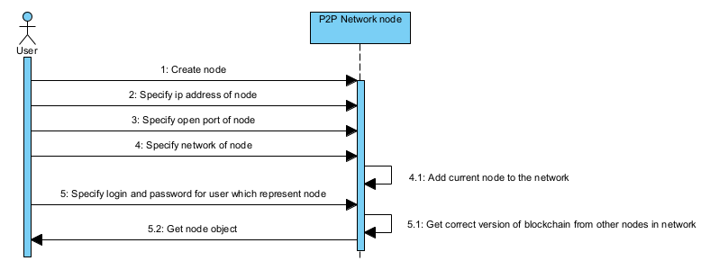

# Simple Proof-of-Work (PoW) blockchain
This project will help you get acquainted with blockchain technologies, especially in terms of deploying blockchain in a peer-to-peer network.

# Short overview
This implementation of the blockchain supports operations such as adding users to the network, creating nodes to maintain the network,
mining blocks, intra-network transfers, as well as a system for rewarding miners for mining and network nodes for maintaining the network on their server.

# Class diagram
 

  

# Simple docs (using UML)
## Use case diagram:
 

  

## Create network:
 

  

## Mine block:
 

  

## Add node to the network:
 

  

## Add user to the network:
 

  

## Transfer currency to other user:
 

  

